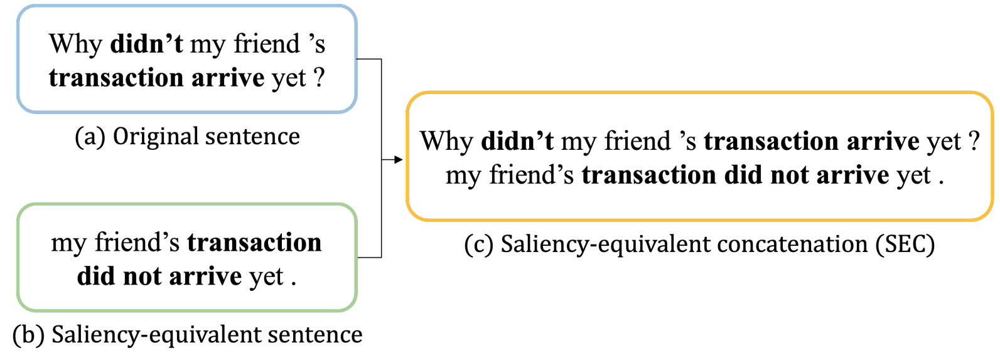

# SEC
This is the implementation of the IEEE AIKE'2022 paper *Few-shot Text Classification with Saliency-equivalent Concatenation* (SEC).

## Introduction to SEC
SEC is an unsupervised data augmentation approach for creating additional key information for a given sentence.



In our experiments (paper link), SEC improves few-shot text classification with several meta-learning models and can be applied to any text classification task.

## Run our code of SEC
### Install required packages
```
pip install -r requirements.txt
python -m spacy download en_core_web_sm
```

### Prepare folders
```
mkdir experiments
```

### Prepare raw data
#### Using T5
- File with one sentence per line.
    - An example file `huffpost_test.txt` is located in the [SEC/data folder](https://github.com/IKMLab/SEC/tree/main/data).

#### Choose the pre-trained T5 model
- English: [t5-large](https://huggingface.co/t5-large)
- Japanese (currently not stable):
    1. [megagonlabs/t5-base-japanese-web](https://huggingface.co/megagonlabs/t5-base-japanese-web)
    2. [sonoisa/t5-base-japanese](https://huggingface.co/sonoisa/t5-base-japanese)
    3. [google/mt5-large (multilingual T5)](https://huggingface.co/google/mt5-large)

### Run the code
- Set `gen_model_name` with the desired pre-trained T5 model name
    - E.g., gen_model_name=google/mt5-large
- An example shell script `run_sec.sh` is located in the [SEC/scripts folder](https://github.com/IKMLab/SEC/tree/main/scripts).
#### Output **tokens** per line. (specify `output_tokens`)
```bash
gpu_id=0
gen_model_name=google/mt5-large
cls_model_name=roberta-large-mnli

python src/t5_summarize.py \
--gpu_id $gpu_id \
--data_path data/huffpost_test.txt \
--batch_size 4 \
--gen_model_name $gen_model_name \
--cls_model_name $cls_model_name \
--decoding_strategy 'top-k' \
--topk_value 40 \
--num_generate_per_sentence 10 \
--filter_mode $mode \
--output_length 128 \
--output_tokens
```
#### Or you can output **text string** per line. (without `--output_tokens`)
```bash
gpu_id=0
gen_model_name=google/mt5-large
cls_model_name=roberta-large-mnli

python src/t5_summarize.py \
--gpu_id $gpu_id \
--data_path data/huffpost_test.txt \
--batch_size 4 \
--gen_model_name $gen_model_name \
--cls_model_name $cls_model_name \
--decoding_strategy 'top-k' \
--topk_value 40 \
--num_generate_per_sentence 10 \
--filter_mode $mode \
--output_length 128
```

#### Output files
Example input filename: data/huffpost_test.txt
##### Using T5
1. Generated sentences (.txt)
    - Default: experiments/t5-large_huffpost_test_10N_topk_40_l128.txt
2. Concatenated sentences (.json)
    - Default: data/t5-large_huffpost_test_10N_topk_40_l128_roberta-large-mnli_E_only.json

#### Parameters
- gpu_id: ID for GPU usage
- data_path: file path of data (one sentence per line)
- batch_size: test batch size for model inference
- gen_model_name: generation model
- cls_model_name: model for sentence filtering
- decoding_strategy: decoding technique during sentence generation
- topk_value: value for top-k sampling (specify one of topk_value, topp_value, and beam_size)
- topp_value: value for top-p sampling (specify one of topk_value, topp_value, and beam_size)
- beam_size: value for beam search (specify one of topk_value, topp_value, and beam_size)
- num_generate_per_sentence: number of synthetic sentences outputed by the generation model
- filter_mode: mode for NLI (natural language inference) during sentence filtering
- output_length: the maximum length of T5-output sequences
- output_tokens: If specified, tokens will be saved in the output file (.json ).

## Cite our paper
Please cite our paper if you use our code. Thank you!
```
@INPROCEEDINGS{9939269,
  author={Lin, Ying-Jia and Chang, Yu-Fang and Kao, Hung-Yu and Wang, Hsin-Yang and Liu, Mu},
  booktitle={2022 IEEE Fifth International Conference on Artificial Intelligence and Knowledge Engineering (AIKE)}, 
  title={Few-shot Text Classification with Saliency-equivalent Concatenation}, 
  year={2022},
  volume={},
  number={},
  pages={74-81},
  doi={10.1109/AIKE55402.2022.00019}}
```
